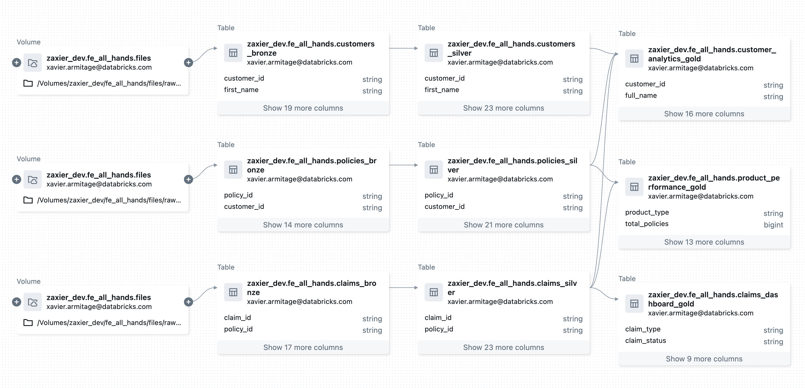

</think>

# AI-Native Demo Framework for Databricks Solution Architects

Transform client demonstrations with AI-generated synthetic data pipelines.

## 🚀 Quick Start

### Requirements
- **Python 3.12+**
- **[uv](https://docs.astral.sh/uv/)** - Fast Python package manager
- **[Databricks CLI](https://docs.databricks.com/en/dev-tools/cli/index.html)** - For workspace authentication
- **AI Coding Assistant**: [Goose](https://github.com/square/goose) or [Claude Code](https://claude.ai/code)

### Zero-to-Demo in 5 Minutes
```bash
# 1. Installation
git clone https://github.com/zaxier/mock-and-roll.git && cd mock-and-roll
make install  # or `uv sync`

# 2. Authenticate to databricks workspace
databricks auth login --host <workspace_url> --profile <profile_name>

# 3. Configuration (minimal setup)
echo "DATABRICKS_CATALOG=<your_catalog>" > .env.local
echo "DATABRICKS_SCHEMA=<your_schema>" >> .env.local
echo "DATABRICKS_CONFIG_PROFILE=<profile_name>" >> .env.local

# 4. Activate python env (or skip and use `uv run python...` below)
source .venv/bin/activate

# 5. Familiarise yourself with the CLI args for overrides
python -m examples.sales_demo -h

# 6. Run the example pipeline
python -m examples.sales_demo --schema mock_and_roll_example
   
# 7. Create a custom demo - with Goose or Claude Code
goose run -t "Create a new synthetic data pipeline for [your industry] with [specific requirements/use cases]"
# or 
claude "Create a new synthetic data pipeline for [your industry] with [specific requirements/use cases]"

> 💡 **Tip**: The AI will automatically scaffold the demo in `src/demos/<demo_name>/` with the required 4 files (`__init__.py`, `__main__.py`, `main.py`, `datasets.py`). Avoid modifying `src/core/` or `src/config/` to maintain framework stability.
```

## 🎯 Why This Framework?

- **Client-Ready Demos**: Generate industry-specific synthetic datasets instantly
- **AI-Accelerated Development**: Prompt-driven pipeline creation using AI assistants
- **Extensible Architecture**: Pre-built skeleton for rapid customization
- **Realistic Data**: [Mimesis](https://mimesis.name/master/)-powered synthetic data generation

## 🤖 How AI Creates Demos in Minutes

The framework is designed for AI coding assistants through:

1. **CLAUDE.md/.goosehints**: Comprehensive AI context with code patterns, function signatures, and best practices
2. **Pre-built Core Functions**: Battle-tested utilities for Spark, I/O, catalog management, and CLI parsing
3. **Standardized Structure**: Every demo follows the same 4-file pattern (init, main, datasets, entry point)
4. **AI-Optimized Workflow**: AI reads patterns → uses core functions → follows structure → generates working demos

### Example AI Prompts
```bash
"Create a synthetic dataset for pharmaceutical clinical trials"
"Generate a supply chain demo for automotive manufacturing"
"Build a customer 360 pipeline for telecommunications"
```

## 🔧 Configuration

Layered configuration with increasing precedence:
1. `config/base.yml` → 2. `config/environments/<ENV>.yml` → 3. `.env` → 4. `.env.local` → 5. Environment variables → 6. CLI arguments

> **Tip**: Use `.env.local` for personal settings and CLI args for runtime overrides.

## 🏗️ Architecture

```
src/
├── config/               # Multi-layer configuration
├── core/                 # Reusable utilities (Spark, I/O, Catalog)
├── examples/             # Demo templates
└── demos/[your_demo]/    # AI-generated pipelines
```

**Auto-Creation**: Volumes ✓ | Schemas ✓ | Catalogs ✗ (requires permission)

## Example Data Lineage Output


## ⚡ Development

```bash
make install         # Install dependencies
make test           # Run all tests
make show-config    # Display configuration
make help           # See all commands
```

**CLI Arguments**: `--schema`, `--catalog`, `--volume`, `--records`, `--log-level`

## 📦 Key Dependencies

Python 3.12+ | databricks-connect | mimesis | pandas | pydantic

---

**Transform your client presentations with AI-generated synthetic data pipelines.**
